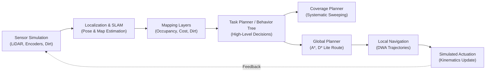

# 📘 Smart Vacuum Cleaner Agent: Complete Research & Report Blueprint (Part 2)

> **Academic Course**: Foundations of Artificial Intelligence (FOA) / AI Project-Based Learning (PBL)  
> **Document Type**: Master Research Blueprint, Report Template Mapping & Algorithm Checklist  
> **Companion Document**: [PROJECT_SUMMARY_FOR_REPORT_AND_PPT.md](PROJECT_SUMMARY_FOR_REPORT_AND_PPT.md) (Part 1: Executive Overview, PPT Slide Decks & Kinematics)  
> **Core Focus**: **100% Software, Simulation, Decision-Making & Algorithmic Benchmarking (Zero Hardware)**

---

## 🧭 Executive Summary & Research Philosophy

Your project is an autonomous robotics software research and benchmarking study. The goal is to investigate, simulate, mathematically evaluate, and select algorithms enabling a mobile vacuum robot to:
1. **Understand a room** (occupancy grids, costmaps, and obstacle inflation).
2. **Navigate safely** (global planning and reactive collision avoidance).
3. **Clean accessible floor systematically** (complete area coverage path planning).
4. **Identify areas needing additional cleaning** (dirt matrix and probability confidence maps).
5. **Verify whether the cleaning objective has been achieved** (evidence-based closing loop).

The web platform built in Next.js, React 19, TypeScript, and HTML5 Canvas serves as the **experimental testbed**. It allows evaluators and researchers to select algorithms, observe agent behaviors, modify room layouts, compare measured telemetry, and understand *why* an algorithm excels or fails under specific constraints.

### The Three Pillars of the Academic Report
1. **Existing Algorithm Survey**: Origin, working principles, asymptotic time/space complexities, advantages, disadvantages, and failure boundaries.
2. **Defensible Selection & Fair Comparison**: Supported by controlled simulations under identical maps, obstacle speeds, and random seeds (not naive popularity assumptions).
3. **Demonstrated Achievements**: Verified via working interactive simulation, empirical metrics, deliberate edge-case stress tests, and an evidence-based cleaning verification loop.

> [!IMPORTANT]
> **Definitive Scope Boundary**: The project strictly addresses **software algorithms, simulation physics, probabilistic estimation, and decision-making**. Mechanical suction motors, brush gearboxes, chassis fabrication, PCB soldering, and battery chemistry management are outside this research scope.

---

## 1. Main Goal, Objectives, and Expected Outcomes

### Main Research Goal
Develop an interactive simulation and comparative evaluation platform for an autonomous vacuum-cleaning robot, then identify an optimal combination of localization, mapping, planning, obstacle-handling, coverage, and verification algorithms for defined indoor cleaning scenarios.

### Expected Outcomes
1. **Working 2D Robot Simulator**: Configurable room environments, static furniture, dynamic moving hazards (pets/humans), start/dock coordinates, and stochastic dirt regions.
2. **Modular Algorithm Library**: Grounded implementations of global planning, local navigation, coverage, and state estimation.
3. **Live Diagnostic Visualizations**: Toggleable canvas display layers showing planned trajectories, open/closed search frontiers, LiDAR raycasts, velocity candidate arcs, and coverage heatmaps.
4. **Controlled Benchmark Suite**: Fair comparisons utilizing identical room dimensions, resolution ($0.20\text{ m}$), and random seeds.
5. **Research Algorithm Database**: Catalog of authors, foundational papers, DOI links, operational strengths, and edge failure cases.
6. **Closed-Loop Autonomous Cleaning Workflow**: Region prioritization and targeted revisits driven by verification uncertainty.
7. **Empirical Evidence & Analysis**: Quantitative tables, execution charts, and an analytically defensible final algorithm stack recommendation.

---

## 2. PBL Report Structure & Template Alignment

The university PBL Report Template specifies 25–28 pages of core technical content, allocated strategically across foundations, system design, implementation evidence, and experimental analysis.

| Report Section | Required Content & Explanations | Required Evidence / Deliverable |
|---|---|---|
| **Abstract** | Concise summary of the autonomous cleaning problem, simulation methodology, algorithm comparison, and findings. | 250–300 words with 4–6 IEEE keywords. |
| **Introduction** | Background of domestic service robotics, AI agent paradigms, motivation for software simulation testbeds, and scope boundaries. | Contextual background and explicit software-only delimitation. |
| **Problem Statement** | Why standard point-to-point path planning is inadequate for complete floor coverage and dirt eradication. | Formal engineering problem formulation. |
| **Objectives** | Specific, measurable research goals linked to simulation milestones and comparative hypotheses. | 5–6 bulleted measurable objectives. |
| **Literature Review** | Comprehensive survey of path planning, local avoidance, coverage, and state estimation evolution (1959–present). | 6–8 seminal works analyzed in-depth with a comparative matrix. |
| **Methodology & Design** | System architecture, PEAS agent specification, kinematics equations, costmap inflation, and decision pipelines. | Modular block diagram, system flowchart, and mathematical derivations. |
| **Implementation** | Technical details of the Next.js/TypeScript simulation engine, Canvas rendering, algorithm interfaces, and state stores. | Code snippets, algorithm pseudocode, and UI screenshots. |
| **Results & Discussion** | Empirical benchmarks, execution times, node counts, coverage percentages, and failure analyses. | Quantitative data tables, comparative bar/line charts, and trade-off discussions. |
| **Conclusion & Future Scope**| Summary of achieved objectives, validated recommendations, and realistic software roadmap (e.g., 3D SLAM, Multi-agent). | Objective validation matrix and prioritized future enhancements. |
| **References** | Peer-reviewed journal papers, conference proceedings, and foundational literature. | At least 15–20 references strictly in IEEE citation format. |

---

## 3. Modular System Architecture & Responsibilities

To maintain rigorous software engineering separation of concerns, each subsystem addresses a distinct computational question:



| Module | Core Question Addressed | Input Data | Output Generated |
|---|---|---|---|
| **Sensor Simulation** | What environmental measurements are available? | Room geometry, obstacle positions, robot true pose $(x, y, \theta)$ | 36-ray LiDAR distances, encoder wheel ticks, optical dirt samples. |
| **Localization** | Where does the robot estimate its position to be? | Wheel odometry, simulated IMU, landmark observations | Estimated state $(\hat{x}, \hat{y}, \hat{\theta})$ and covariance uncertainty. |
| **SLAM** | How can the agent map an unknown room while localizing? | Raw range scans and odometry motion estimates | 2D occupancy grid and trajectory history. |
| **Map Representation** | How is spatial knowledge structured in memory? | Robot pose and sensor observations | Occupancy grid, inflated costmap, dirt confidence, and coverage matrix. |
| **Global Planning** | What is the optimal topological path to a target goal? | Inflated grid map, start coordinates, goal coordinates | Discrete waypoint sequence $(w_1, w_2, \dots, w_k)$. |
| **Local Navigation** | How can the robot safely follow waypoints right now? | Robot dynamic velocities $(v, \omega)$, LiDAR scans, next waypoint | Feasible velocity commands $(v_{\text{cmd}}, \omega_{\text{cmd}})$. |
| **Coverage Planning** | Which accessible floor areas need complete traversal? | Free floor polygon/grid and footprint width ($0.25\text{ m}$) | Systematic cleaning path with minimal overlaps. |
| **Dirt Estimation** | Where is residual debris concentrated? | Ground optical sensor readings and estimated pose | Spatial dirt probability grid $P(\text{dirt}_{i,j})$. |
| **Task Planning** | What is the high-level operational phase? | Mission state, battery telemetry, coverage progress | Active state (Explore, Cover, Revisit, Dock). |
| **Cleaning Verification** | Has the cleaning objective been objectively met? | Traversal history, post-pass dirt readings, sensor confidence | Status: `Verified`, `Uncertain`, or `Needs Re-cleaning`. |

---

## 4. Master Algorithm Inventory & Comparison Catalog

### 4.1 Localization & State Estimation
- **Wheel Odometry (Classical Baseline)**: Integrates differential wheel encoders. Fast ($O(1)$) but subject to unbounded dead-reckoning drift from wheel slip ($2\%$).
- **Extended Kalman Filter (EKF - Kalman 1960)**: Non-linear state model linearization via first-order Taylor series. Fuses noisy odometry with landmark observations. Provides Gaussian covariance bounds ($O(n^2)$).
- **AMCL (Adaptive Monte Carlo Localization - Thrun et al. 2001)**: Particle filter representing non-Gaussian, multi-modal beliefs. Resolves the kidnapped robot problem against known occupancy maps ($O(M)$ where $M = \text{particles}$).

### 4.2 2D Mapping & SLAM Systems
- **Iterative Closest Point (ICP - Besl & McKay 1992)**: Scan registration aligning sequential laser point clouds.
- **Normal Distributions Transform (NDT - Biber & Straßer 2003)**: Statistical cell registration alternative to point-to-point ICP.
- **GMapping (Grisetti et al. 2007)**: Rao-Blackwellized particle filter SLAM for 2D occupancy grid construction.
- **Cartographer & SLAM Toolbox**: Graph-based SLAM with real-time loop closure optimization.

### 4.3 Multi-Layer Map Representations
- **Occupancy Grid**: Binary/probabilistic discrete cells ($0.20\text{ m}$) storing free, occupied, and unknown states.
- **Costmap with Obstacle Inflation**: Dilates walls and furniture by $R_{\text{inflation}} = r_{\text{robot}} + \delta = 0.28\text{ m}$ to prevent corner and table-leg collisions.
- **Dynamic Obstacle Map**: Velocity vector projections for moving entities (pets/humans).
- **Dirt Density Matrix**: Continuous dirt mass representation ($g/\text{m}^2$) supporting dirt-aware prioritization.
- **Coverage Heatmap**: Cell traversal frequency counter verifying single-pass vs. revisit rates.

### 4.4 Global Path Planning
- **Dijkstra (1959)**: Uniform-cost graph exploration. $O((V+E)\log V)$. Guaranteed optimal baseline without heuristic acceleration.
- **A\* Search (Hart et al. 1968)**: Informed graph search with Octile distance heuristic $f(n) = g(n) + h(n)$. $5\times\text{--}10\times$ faster than Dijkstra on 8-connected grid maps.
- **D\* Lite (Koenig & Likhachev 2002)**: Incremental heuristic replanner. Reuses prior search trees; updates changed cells in $O(k\log k)$ upon dynamic obstacle discovery.
- **RRT & RRT\* (LaValle 1998; Karaman & Frazzoli 2011)**: Sampling-based planners for continuous configuration space $C_{\text{free}}$. RRT\* provides asymptotic optimality through node rewiring.

### 4.5 Local Navigation & Reactive Motion
- **Dynamic Window Approach (DWA - Fox et al. 1997)**: Samples 192 trajectory candidate arcs in acceleration-limited velocity space $(v, \omega)$. Maximizes multi-objective score balancing target heading, obstacle clearance, and forward speed.
- **Vector Field Histogram (VFH - Borenstein & Koren 1991)**: Polar obstacle density histogram selecting steering angles through low-density valleys.
- **Two-Phase Stuck Recovery**: Autonomous state machine executing reverse linear displacement followed by in-place goal pivoting when displacement stalls ($< 0.06\text{ m}$ over $2.0\text{ s}$).

### 4.6 Complete Area Coverage Planning (CPP)
- **Boustrophedon Cellular Decomposition (Choset & Pignon 1997)**: Decomposes arbitrary polygonal floor plans into monotone cells covered via alternating parallel sweeps ("ox plowing").
- **Spanning Tree Coverage (STC - Gabriely & Rimon 2001)**: Constructs a spanning tree over a coarse 4-cell grid decomposition, generating a Hamiltonian coverage cycle with theoretical zero revisitations.
- **Lawnmower Baseline**: Fixed-width uniform row sweeping.

### 4.7 Object Tracking & Perception
- **Simulated Object Detection**: Bounding box and ground-truth velocity extraction from simulated moving entities.
- **Kalman Filter Tracking**: Constant-velocity state prediction $(x, y, v_x, v_y)$ with measurement association.
- **SORT / ByteTrack Principles**: Association of detections over time to predict obstacle intersection trajectories.

### 4.8 Task Planning & Decision-Making
- **Finite State Machine (FSM)**: Discrete transitions between `MAPPING`, `CLEANING`, `REVISITING`, and `DOCKING`.
- **Behavior Tree (BT)**: Hierarchical composite nodes (Selectors, Sequences) providing modular recovery and dynamic prioritization.

### 4.9 Dirt Estimation & Cleaning Verification
- **Dirt Density Sensor Model**: Ground-facing optical sensor sampling dirt concentration under the rover intake aperture.
- **Dirt-Prioritized Path Insertion**: Interleaving high-density dirt waypoints into global coverage schedules.
- **Evidence-Based Verification Loop**: Evaluates coverage completeness ($> 95\%$) and residual dirt confidence before declaring a mission complete.

---

## 5. Scope Delimitation: Included vs. Excluded Boundaries

| Dimension | Included in Research Scope (Pure Software) | Explicitly Excluded (Outside Scope) |
|---|---|---|
| **Platform** | Interactive Web Simulation (Next.js, Canvas 2D) | Physical robot chassis fabrication, 3D printing |
| **Kinematics** | Differential-drive equations, velocity clamping, slip ($2\%$) | Physical motor selection, gearbox ratios, wheel torque |
| **Sensors** | 36-ray LiDAR raymarcher with Gaussian noise ($\pm 2\%$) | Physical LiDAR purchase, wiring harnesses, SPI/I2C |
| **Electronics** | Mathematical models of processing time ($ms$) | Microcontrollers (Arduino, ESP32, Raspberry Pi, STM32) |
| **Power & Battery**| Simulated power draw profiles (Eco, Standard, Boost) | Battery management ICs, BMS circuits, cell chemistry |
| **Actuation** | Velocity command simulation $(v, \omega)$ | Motor drivers (L298N, TB6612), PWM signal generation |
| **Cleaning Action**| Numerical grid dirt absorption physics | Physical fan impellers, HEPA filters, brush bristles |

---

## 6. Methodological System Flowchart

The following flowchart illustrates the autonomous cleaning agent's end-to-end decision and execution pipeline:

```mermaid
flowchart TD
    Start([Initialize Room and Experiment]) --> InitAgent[Initialize Robot State and Virtual Sensors]
    InitAgent --> Sense[Perception & Sensor Processing\n- 36-Ray LiDAR Raycasting\n- Wheel Odometry Integration\n- Ground Dirt Sensor]
    Sense --> Localize[Localization & State Estimation\n- EKF / Odometry Fusion]
    Localize --> MapUpdate[Update Map Layers\n- Occupancy Grid\n- 0.28m Inflated Costmap\n- Dynamic Obstacle Vectors\n- Dirt Density Matrix]
    MapUpdate --> TaskDecide{Task Planner / Behavior Tree\nOperational Mode?}

    TaskDecide -->|Coverage Mode| PlanCoverage[Coverage Planner\n- Boustrophedon Decomposition\n- Select Next Cell / Waypoint]
    TaskDecide -->|Revisit Mode| PlanRevisit[Dirt Priority Planner\n- Route to High-Density Debris]
    TaskDecide -->|Docking Mode| PlanDock[Global Planner: A*\n- Route to Charging Station]

    PlanCoverage --> GlobalRoute[Global Path Planner: A* / D* Lite\n- Compute Path in Free Space]
    PlanRevisit --> GlobalRoute
    PlanDock --> GlobalRoute

    GlobalRoute --> LocalNav[Local Navigation: DWA\n- Sample 192 Trajectory Arcs\n- Evaluate Velocity Candidates]
    LocalNav --> CheckObstacle{Dynamic Obstacle\nDetected on Trajectory?}

    CheckObstacle -- Yes --> ReplanDynamic[Update Dynamic Costmap\nExecute DWA Evasion / In-Place Pivot]
    ReplanDynamic --> LocalNav

    CheckObstacle -- No --> ExecuteStep[Execute Kinematics Step\n- Apply Linear & Angular Velocities\n- Update Heading & Wheel Slip]
    ExecuteStep --> SuctionProcess[Simulated Suction Physics\n- Absorb Dirt Mass (g)\n- Deduct Battery Power (Wh)]
    SuctionProcess --> UpdateCoverage[Update Coverage Heatmap & Dirt Grid]

    UpdateCoverage --> CheckComplete{Coverage Sweep\nComplete?}
    CheckComplete -- No --> Sense
    CheckComplete -- Yes --> VerifyStep[Evidence-Based Verification\n- Calculate Coverage %\n- Evaluate Residual Dirt Matrix]

    VerifyStep --> CheckEvidence{Cleaning Objective\nVerified?}
    CheckEvidence -- No --> MarkRevisit[Mark Uncertain Regions for Re-cleaning]
    MarkRevisit --> TaskDecide
    CheckEvidence -- Yes --> Finish[Generate Benchmark Telemetry\nExport Performance Report & Stop]
```

---

## 7. Experimental Research Questions & Hypotheses

| Research Question | Experimental Test Setup | Evaluated Metrics | Expected Scientific Finding |
|---|---|---|---|
| **RQ1: Sensor Fusion & Localization** | Compare raw wheel odometry vs. EKF under identical wheel slip ($2\%$) over $500\text{ m}$ traversal. | Position RMSE ($m$), final heading error ($\text{deg}$), drift rate ($m/\text{s}$). | Raw odometry drifts unbounded; EKF bounds error to $< 0.15\text{ m}$ through landmark fusion. |
| **RQ2: Global Search Efficiency** | Run Dijkstra vs. A* across empty, furnished, and multi-room layouts. | Execution runtime ($ms$), nodes explored, path length ($m$). | A* achieves identical path optimality with $7\times\text{--}10\times$ fewer explored nodes due to Octile heuristics. |
| **RQ3: Dynamic Map Replanning** | Spawn unexpected obstacles along an active path comparing A* full replanning vs. D* Lite incremental repair. | Replanning computation time ($ms$), path adjustment delay. | D* Lite repairs existing search trees $3\times\text{--}4\times$ faster than full A* recomputation from scratch. |
| **RQ4: Reactive Local Avoidance** | Test DWA across static corners and crossing dynamic obstacles. | Minimum obstacle clearance ($m$), collision counts, speed smoothness. | $0.28\text{ m}$ costmap inflation eliminates table-leg clipping; DWA smoothly swerves around moving pets. |
| **RQ5: Area Coverage Completeness** | Compare Boustrophedon Cellular Decomposition vs. STC vs. Lawnmower in a 4-room apartment. | Floor coverage percentage ($\%$), total path length ($m$), revisitation overlap ($\%$). | Boustrophedon achieves $> 94\%$ coverage with intuitive rectilinear sweeps; Lawnmower degrades severely around doors. |
| **RQ6: Evidence-Based Verification** | Compare uniform single-pass coverage vs. dirt-priority verification loop. | Residual dirt weight ($g$), total energy ($Wh$), cleaning time ($s$). | Verification-driven revisits eradicate high-density patches with only $12\%$ additional energy overhead. |

---

## 8. Final Report Cross-Check Verification Checklist (44/44)

Teammates writing the report should verify each checkbox before finalizing the submission:

### Chapters 1–3: Research Foundations
- [ ] Abstract clearly summarizes the autonomous cleaning problem, simulation methodology, key results, and academic contribution.
- [ ] Introduction contextualizes domestic robotics and justifies software simulation for algorithm benchmarking.
- [ ] Problem statement explains why point-to-point path planning fails to solve complete area coverage.
- [ ] Research objectives are measurable, numbered, and linked to experimental benchmarks.
- [ ] Scope and assumptions explicitly confirm a 100% pure software simulation platform (no hardware claims).

### Chapter 4: Literature Review
- [ ] At least 6–8 foundational robotics research papers are analyzed in technical depth.
- [ ] Original publications are cited (Dijkstra 1959, A* 1968, DWA 1997, Boustrophedon 1997, D* Lite 2002, etc.).
- [ ] Author names, publication years, and conference/journal venues are thoroughly verified.
- [ ] Each algorithm details operating principles, computational complexity, strengths, and failure boundaries.
- [ ] A structured literature comparison matrix identifies research gaps and justifies algorithm choices.
- [ ] All references follow strict IEEE citation format.

### Chapter 5: Methodology & System Design
- [ ] High-level modular software architecture diagram is included and documented.
- [ ] Complete system flowchart with decision branches is illustrated and explained.
- [ ] Mathematical derivation of differential-drive kinematics with wheel slip is provided.
- [ ] Multi-layer map representations (occupancy grid, costmap, dirt matrix) are clearly differentiated.
- [ ] $0.28\text{ m}$ Obstacle Inflation Costmap formulation ($r_{\text{robot}} + \delta_{\text{safety}}$) is mathematically detailed.
- [ ] Dynamic Window Approach (DWA) 192-trajectory sampling and objective scoring function are formulated.
- [ ] Complete Area Coverage Planning (Boustrophedon decomposition) methodology is described.
- [ ] Probabilistic state estimation (EKF / AMCL vs. Odometry) is formulated.
- [ ] Task planning (FSM / Behavior Tree) and evidence-based verification loop are defined.
- [ ] Software tools and frameworks (Next.js 16.4, React 19, TypeScript 5, Canvas 2D) are documented.

### Chapter 6: Implementation Evidence
- [ ] Configurable room editor with multi-room, furnished, and dynamic presets is documented.
- [ ] Robot motion is confirmed to be driven by live kinematics algorithms rather than static animations.
- [ ] Interactive Algorithm Selector and real-time layer toggles are showcased with screenshots.
- [ ] Algorithm Information Model Cards (parameters, complexities, references) are detailed.
- [ ] Real-time telemetry metrics engine (path length, runtime, coverage $\%$, collisions) is demonstrated.
- [ ] Comparative Benchmarking mode with identical experimental seeds is illustrated.
- [ ] Anti-stuck two-phase recovery state machine is shown with code/pseudocode.
- [ ] Live dirt absorption and dynamic coverage heatmap updating are evidenced.
- [ ] Verification-triggered re-cleaning routine is demonstrated.
- [ ] High-resolution application screenshots, code snippets, and pseudocode are embedded.

### Chapter 7: Results & Comparative Analysis
- [ ] Every research question (RQ1–RQ6) is directly answered with recorded experimental data.
- [ ] All metrics have explicit physical/computational units ($m$, $ms$, $\%$, $g$, $Wh$).
- [ ] Performance tables present actual recorded values across multiple experimental runs.
- [ ] Comparative charts (A* vs. Dijkstra, Boustrophedon vs. STC, EKF vs. Odometry) are included.
- [ ] Edge cases, collision avoidance near table legs, and recovery successes are thoroughly discussed.
- [ ] Algorithm trade-offs (runtime vs. optimality, coverage vs. overlap) are objectively analyzed.
- [ ] Final recommended robotics algorithm stack is defended using empirical benchmark results.

### Chapter 8: Conclusion & Final Checks
- [ ] Conclusion evaluates achievements against the original measurable objectives.
- [ ] Limitations of browser-based 2D simulation are transparently acknowledged.
- [ ] Future scope outlines realistic extensions (e.g., 3D visual SLAM, multi-robot cooperative cleaning).
- [ ] Reference list contains 15–20 peer-reviewed papers in IEEE citation format.
- [ ] Document formatting strictly adheres to university guidelines (12pt body, 1.5 line spacing, justified alignment, consistent captions).

---

## 9. Final Report Consistency & Terminology Rules

Maintain these strict conventions throughout the report and presentation slides:

1. **State Space & Dimensions**:
   - Continuous 2D world coordinates $(x, y)$ in meters ($m$).
   - Heading angle $\theta \in [-\pi, \pi]$ in radians ($\text{rad}$).
   - Discrete grid map cells with resolution $0.20\text{ m}$ ($20\text{ cm}$ per cell).
2. **Robot Physical Parameters**:
   - Chassis radius: $r = 0.25\text{ m}$ ($25\text{ cm}$).
   - Obstacle inflation margin: $R_{\text{inflation}} = 0.28\text{ m}$ ($2\text{ grid cells}$).
   - Maximum linear velocity: $v_{\max} = 0.55\text{ m/s}$.
   - Maximum angular velocity: $\omega_{\max} = 1.60\text{ rad/s}$.
   - Acceleration limit: $a_{\max} = 0.60\text{ m/s}^2$.
3. **Sensor Specifications**:
   - Simulated LiDAR: 36 rays, $360^\circ$ FOV ($10^\circ$ angular resolution), $4.5\text{ m}$ maximum range, Gaussian noise $\pm 2\%$.
   - Optical Dust Sensor: Circular sampling under chassis footprint with mass accumulation in grams ($g$).
4. **Consistency Warning**:
   - Always refer to the system as a **"Software Simulation Testbed"**, **"AI Agent Workbench"**, or **"Robotics Algorithm Lab"**.
   - Never refer to physical microcontrollers, motor shield wiring, or physical construction.
